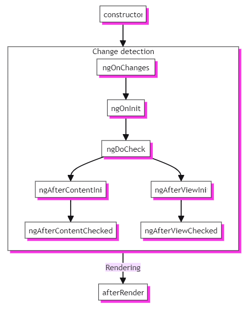
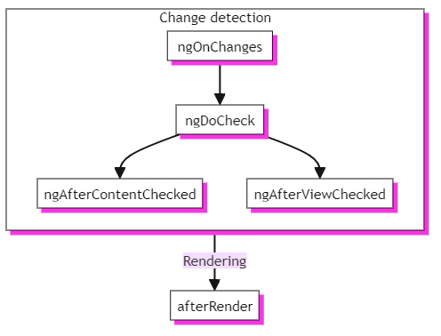

## 1. 라이프사이클

컴포넌트의 라이프사이클은 구성 요소의 생성과 파괴 사이에 발생하는 단계의 순서입니다. 각 단계는 구성 요소를 랜더링하고 시간 경과에 따라 업데이트를 확인하는 Angular 프로세스의 다른 부분을 나타냅니다.

이러한 단계 중에 코드를 실행하기 위해 라이프사이클 훅을 구현할 수 있습니다. 모든 주기에서 구현할 필요는 없고, 특정 주기에 구현해야할 기능이 있을 때 필요한 해당 훅 메소드를 구현하면 됩니다.

### Angular 생명주기 메서드 요약

| 단계             | 방법                    | 요약                                                                             |
| ---------------- | ----------------------- | -------------------------------------------------------------------------------- |
| Creation         | `constructor`           | 표준 JavaScript 클래스 생성자. Angular가 구성 요소를 인스턴스화할 때 실행됩니다. |
| Change Detection | `ngOnInit`              | Angular가 모든 구성 요소의 입력을 초기화한 후에 한 번 실행됩니다.                |
| Change Detection | `ngOnChanges`           | 구성 요소의 입력이 변경될 때마다 실행됩니다.                                     |
| Change Detection | `ngDoCheck`             | 이 구성 요소의 변경 사항이 확인될 때마다 실행됩니다.                             |
| Change Detection | `ngAfterViewInit`       | 구성 요소의 뷰가 초기화된 후에 한 번 실행됩니다.                                 |
| Change Detection | `ngAfterContentInit`    | 구성 요소의 콘텐츠가 초기화된 후에 한 번 실행됩니다.                             |
| Change Detection | `ngAfterViewChecked`    | 구성 요소의 뷰에서 변경 사항이 확인될 때마다 실행됩니다.                         |
| Change Detection | `ngAfterContentChecked` | 이 구성 요소 콘텐츠의 변경 사항이 확인될 때마다 실행됩니다.                      |
| Rendering        | `afterNextRender`       | 모든 구성 요소가 DOM에 렌더링될 때 한 번 실행됩니다.                             |
| Rendering        | `afterRender`           | 모든 구성 요소가 DOM에 렌더링될 때마다 실행됩니다.                               |
| Destruction      | `ngOnDestroy`           | 구성 요소가 파괴되기 전에 한 번 실행됩니다.                                      |

### 실행 순서

- 초기화 중
  

- 이후
  
