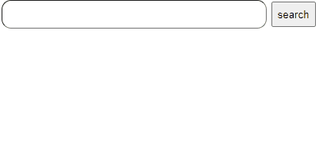

---
emoji:
title: javascript search bar component
date: '2024-07-23 17:00:00'
author: 손재형
tags: javascript
categories: javascript
---

원티드 2024.08 프리온보딩 프론트엔드 사전 과제로 search bar 컴포넌트 구현이 나왔다.

## 결과



## 신경 썼던 것

- 각각의 데이터의 타입으로 묶어서 보기 정렬
- input value에 따라 하이라이트 적용
- 디바운싱 적용

### 각각의 데이터의 타입으로 묶어서 보기 정렬

```js
function getData() {
  const groupedData = dummy.reduce((acc, item) => {
    if (!acc[item.type]) {
      acc[item.type] = [];
    }
    acc[item.type].push(item);
    return acc;
  }, {});

  for (const [type, items] of Object.entries(groupedData)) {
    const typeHeader = document.createElement('div');
    typeHeader.innerText = type;
    typeHeader.setAttribute('id', 'typeHeader');
    resultDiv.appendChild(typeHeader);

    items.forEach((item) => {
      const p = document.createElement('p');
      p.setAttribute('id', 'resultparagraph');
      p.setAttribute('key', item.key);
      p.innerText = item.description;
      resultDiv.appendChild(p);
    });
  }
}
```

getData 함수는 DOM 로드 시에 실행되도록 했다.

- 데이터 예시 - { description: "(ORCL) Oracle Corp", key: "Oracle Corp", type: "COMPANY" },
  이런 형태인데 reduce를 사용하여 type 별로 데이터를 묶었다.
  객체 전부를 반복문을 통해 돌기 위해 Object.entries 사용하여 배열로 변경
  key가 된 type이 헤더가 되고 value가 items로 만들어 id = result인 div에 넣음

### input value에 따라 하이라이트 적용

```js
function highlight(value) {
  const paragraphs = resultDiv.getElementsByTagName('p');

  for (const p of paragraphs) {
    const text = p.innerText;
    const regex = new RegExp(`(${value})`, 'gi');
    if (value) {
      const newText = text.replace(regex, '<span class="highlight">$1</span>');
      p.innerHTML = newText;
    } else {
      p.innerHTML = text;
    }
  }
}
```

정규 표현식을 사용하여 문자 대조 후 클래스 변경

- const regex = new RegExp((${value}), "gi");

  - value를 대소문자 구분없이 정규 표현식으로 변환

- const newText = text.replace(regex, '<span class="highlight">$1</span>');
  - 정규 표현식으로 바꾼 값과 일치한게 있다면 강조 효과 css 적용
  - $1은 정규 표현식 첫 번째 그룹. 사용자가 입력한 문자열

### 디바운싱 적용

```js
function debounce(func, delay) {
  let timeout;
  return function (...args) {
    clearTimeout(timeout);
    timeout = setTimeout(() => func(...args), delay);
  };
}

// -----------------------------------------------------

const debouncedHighlight = debounce((value) => {
  highlight(value);
}, 300); // 300ms 지연

input.addEventListener('input', (event) => {
  resultDiv.style.display = 'block';
  debouncedHighlight(event.target.value);
});
```

위의 highlight 함수와 debounce 함수를 합쳐서 같이 실행하게 하여
모든 입력에 적용되어 과하게 요청을 보내지 않도록 했다.

## 개선사항

- 요구사항에서 데이터를 전부 출력하고 그 중 겹치는 것을 강조하도록 하게 했는데
- 이 방식은 데이터가 많을 경우 좋지 않을 것 같다.
- 입력한 value가 들어간 키워드만 나오도록 하는 게 성능적으로 더 나을 것 같다.
