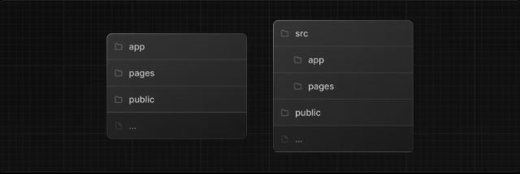

---
emoji:
title: next.js app router
date: '2024-07-05 15:00:00'
author: 손재형
tags: Next
categories: Next
---

next.js의 app router 방식에 대해 알아보자.

- next js 13 버전부터 도입된 방식
- 알아두면 좋은 점: 앱 라우터는 페이지 라우터보다 우선순위가 높습니다. 디렉터리 간 경로는 동일한 URL 경로로 확인되어서는 안 되며 충돌을 방지하기 위해 빌드 시간 오류가 발생합니다.

## 프로젝트 구조

- 최상위 폴더
  

| 폴더   | 설명                      |
| ------ | ------------------------- |
| app    | 앱 라우터                 |
| page   | 페이지 라우터             |
| public | 정적 에셋                 |
| src    | 일반적인 패턴을 위한 폴더 |

### src

- 프로젝트 루트에 특별한 Next.js 앱이나 페이지 디렉터리를 두는 대신 Next.js는 src 디렉터리 아래에 애플리케이션 코드를 배치하는 일반적인 패턴도 지원합니다.

- 이는 대부분 개인과 팀이 선호하는 프로젝트 루트에 있는 프로젝트 구성 파일과 애플리케이션 코드를 분리합니다.

- src 디렉터리를 사용하려면 앱 라우터 폴더나 페이지 라우터 폴더를 각각 src/app 또는 src/pages로 이동하세요.


## 라우팅 기본 사항


- Tree: 계층 구조를 시각화하기 위한 규칙입니다. 예를 들어 상위 및 하위 구성 요소가 있는 구성 요소 트리, 폴더 구조 등이 있습니다.
- Subtree: 새 루트(첫 번째)에서 시작하여 잎(마지막)에서 끝나는 트리의 일부입니다.
- Root: 루트 레이아웃과 같은 트리 또는 하위 트리의 첫 번째 노드입니다.
- Leaf: URL 경로의 마지막 세그먼트와 같이 자식이 없는 하위 트리의 노드입니다.

### 폴더 및 파일의 역할

폴더는 경로를 정의하는 데 사용됩니다. \
경로는 루트 폴더부터 page.js 파일이 포함된 최종 리프 폴더까지 파일 시스템 계층 구조를 따라가는 중첩된 폴더의 단일 경로입니다.


- / (Root segment)
- dashboard (Segment)
- settings (Leaf segment)

## 파일 컨벤션

Next.js는 중첩된 경로에서 특정 동작으로 UI를 생성하기 위한 특수 파일 세트를 제공합니다.

| 항목         | 설명                                                                     |
| ------------ | ------------------------------------------------------------------------ |
| layout       | 세그먼트 및 해당 하위 항목에 대한 공유 UI                                |
| page         | 경로의 고유한 UI를 제공하고 경로를 공개적으로 액세스할 수 있도록 합니다. |
| loading      | 세그먼트 및 해당 하위 항목에 대한 UI 로드 중                             |
| not-found    | 세그먼트 및 해당 하위 항목에 대한 찾을 수 없음 UI                        |
| error        | 세그먼트 및 해당 하위 항목에 대한 오류 UI                                |
| global-error | 전역 오류 UI                                                             |
| route        | server-side API endpoint                                                 |
| template     | Specialized re-rendered Layout UI                                        |
| default      | Fallback UI for Parallel Routes                                          |

## Dynamic Routes

폴더 이름을 대괄호 [] 로 묶어 생성할 수 있습니다. \
예를 들어 [id] 또는 [slug]

### 예시

예를 들어 블로그에는 app/blog/[slug]/page.js 경로가 포함될 수 있습니다. 여기서 [slug]는 블로그 게시물의 동적 세그먼트입니다.

```ts
export default function Page({ params }: { params: { slug: string } }) {
  return <div>My Post: {params.slug}</div>;
}
```

| Route                   | Example URL | params        |
| ----------------------- | ----------- | ------------- |
| app/blog/[slug]/page.js | /blog/a     | { slug: 'a' } |
| app/blog/[slug]/page.js | /blog/b     | { slug: 'b' } |
| app/blog/[slug]/page.js | /blog/c     | { slug: 'c' } |

## Catch All Segments

[...folderName] 괄호 안에 줄임표를 추가하여 동적 세그먼트를 모든 후속 세그먼트로 확장할 수 있습니다. \
예를 들어 app/shop/[...slug]/page.js는 /shop/clothes와 일치하지만 /shop/clothes/tops, /shop/clothes/tops/t-shirts 등과도 일치합니다.

| Route                      | Example URL | params                    |
| -------------------------- | ----------- | ------------------------- |
| app/shop/[...slug]/page.js | /shop/a     | { slug: ['a'] }           |
| app/shop/[...slug]/page.js | /shop/a/b   | { slug: ['a', 'b'] }      |
| app/shop/[...slug]/page.js | /shop/a/b/c | { slug: ['a', 'b', 'c'] } |

### optional

대괄호를 한 번 더 감싸면 ([[...folderName]]) 선택적으로 만들 수 있음 \
app/shop/[[...slug]]/page.js가 \
/shop \
/shop/clothes \
/shop/tops 등과 일치함 \
매개변수가 없는 경로도 일치하게 함

## Parallel Routes

Parallel Routes를 사용하면 동일한 레이아웃 내에서 하나 이상의 페이지를 동시에 또는 조건부로 렌더링할 수 있습니다. 이는 대시보드 및 소셜 사이트의 피드와 같이 앱의 매우 동적인 섹션에 유용합니다.

예를 들어 대시보드를 고려하면 Parallel Routes를 사용하여 팀 및 분석 페이지를 동시에 렌더링할 수 있습니다.


### slot

Parallel Routes는 명명된 슬롯을 사용하여 생성됩니다. 슬롯은 @folder 규칙으로 정의됩니다. \
예를 들어 다음 파일 구조는 @analytics 및 @team이라는 두 개의 슬롯을 정의합니다.


```ts
// app/layout.tsx
export default function Layout({
  children,
  team,
  analytics,
}: {
  children: React.ReactNode;
  analytics: React.ReactNode;
  team: React.ReactNode;
}) {
  return (
    <>
      {children}
      {team}
      {analytics}
    </>
  );
}
```

그러나 슬롯은 경로 세그먼트가 아니며 URL 구조에 영향을 주지 않습니다. 예를 들어 /@analytics/views의 경우 @analytics가 슬롯이므로 URL은 /views가 됩니다.

```toc

```
