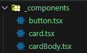

---
emoji:
title: next.js 폴더 구조 + 팁
date: '2024-07-04 15:00:00'
author: 손재형
tags: Next
categories: Next
---

## Next app router

- app router 방식은 폴더 네이밍대로 routing이 생긴다.
- 이게 아주 편리하지만 ... 폴더가 많으면 너무 복잡해진다

- 위와 같이 폴더를 구성하고
- components 안에 pages.tsx를 작성하면
- (주소)/components 라는 경로의 페이지가 만들어져 버린다

- 위 같은 문제를 방지하기 위해 next는 폴더 규칙이 있다.

## Route group

- route가 될 수 있는 페이지들을 하나의 그룹으로 묶을 수 있게 해줌
- 규칙은 (name)
  

## Private folder

- page.tsx를 만들더라도 route를 생성하지 않게 하려면
- 폴더 앞에 \_ 를 붙이면 된다.
  

## Next에서 API KEY 숨기기

- API KEY나 환경 변수 같은 것 들은 .env 파일에 저장한다.
- root에 .env 파일을 만들고 변수 작성하면 됨.
- 불러올 때 process.env.변수이름 으로 불러오면 된다.
