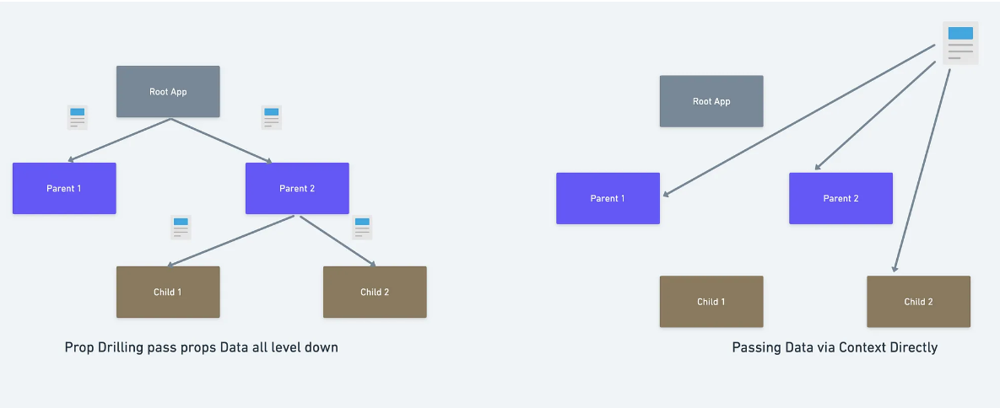

Prop drilling vs Context API, How the data is passed

## Props Drilling

- props를 오로지 하위 컴포넌트로 전달하는 용도로만 쓰이는 컴포넌트들을 거치면서 React Component 트리의 한 부분에서 다른 부분으로 데이터를 전달하는 과정
- 여러 컴포넌트를 거쳐 prop 된다면 데이터 추적이 어려워 유지보수가 어려워지게 된다.

- context를 이용하면 단계마다 일일이 props를 넘겨주지 않고도 컴포넌트 트리 전체에 데이터를 제공할 수 있음

## 언제 context를 써야 할까

- context는 트리 안에서 전역적이라고 볼 수 있는 데이터를 공유하도록 고안된 방법
- ex : 현재 로그인한 유저 정보, 테마, 선호 언어 등

```ts
// context를 사용하면 모든 컴포넌트를 일일이 통하지 않고도
// 원하는 값을 컴포넌트 트리 깊숙한 곳까지 보낼 수 있습니다.
// light를 기본값으로 하는 테마 context를 만들어 봅시다.
const ThemeContext = React.createContext('light');

class App extends React.Component {
  render() {
    // Provider를 이용해 하위 트리에 테마 값을 보내줍니다.
    // 아무리 깊숙히 있어도, 모든 컴포넌트가 이 값을 읽을 수 있습니다.
    // 아래 예시에서는 dark를 현재 선택된 테마 값으로 보내고 있습니다.
    return (
      <ThemeContext.Provider value="dark">
        <Toolbar />
      </ThemeContext.Provider>
    );
  }
}

// 이젠 중간에 있는 컴포넌트가 일일이 테마를 넘겨줄 필요가 없습니다.
function Toolbar() {
  return (
    <div>
      <ThemedButton />
    </div>
  );
}

class ThemedButton extends React.Component {
  // 현재 선택된 테마 값을 읽기 위해 contextType을 지정합니다.
  // React는 가장 가까이 있는 테마 Provider를 찾아 그 값을 사용할 것입니다.
  // 이 예시에서 현재 선택된 테마는 dark입니다.
  static contextType = ThemeContext;
  render() {
    return <Button theme={this.context} />;
  }
}
```

## API

### React.createContext

```ts
const MyContext = React.createContext(defaultValue);
```

- context 객체를 만듦
- context 객체를 구독하고 있는 컴포넌트를 랜더링할 때 React는 트리 상위에서 가장 가까이 있는 짝이 맞는 Provider로부터 현재값을 읽음

### Context.Provider

- context 객체 안에 provider 컴포넌트가 있음
- 컴포넌트 간 공유하고자 하는 값을 value라는 props로 설정하면 자식 컴포넌트에서 바로 접근 가능

```ts
function App() {
  return (
    <MyContext.Provider value="Hello World">
      <GrandParent />
    </MyContext.Provider>
  );
}
```

```ts
import { createContext, useContext } from 'react';

function Message() {
  const value = useContext(MyContext);
  return <div>Received: {value}</div>;
}
```

- useContext를 통해 자식 컴포넌트에서 context에 넣은 값에 접근
