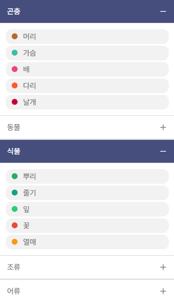

리액트 프로젝트에서 드롭다운 메뉴를 만들어야 했다.



위 사진과 같고 각각의 메뉴는 독립적으로 열리고 닫히기가 가능해야 한다.

```ts
const [openMenus, setOpenMenus] = useState(Array(groups.length).fill(false));
```

groups는 전체 그룹들을 담고있는 배열이고 groups와 길이가 같은 false로만 채운 배열을 기본값으로 설정

```ts
const toggleSubMenu = (index: number) => {
  // 현재 메뉴의 상태를 반전시킴
  const newOpenMenus = [...openMenus];
  newOpenMenus[index] = !newOpenMenus[index];
  setOpenMenus(newOpenMenus);
};
```

토글 함수로 해당하는 인덱스 번호의 상태를 변화시킴

```ts
<li key={index}>
  <div
    className={`project_class_list_group ${openMenus[index] ? 'active' : ''}`}
    onClick={() => toggleSubMenu(index)}
  >
    {group.name} {openMenus[index] ? <FiMinus /> : <FiPlus />}
  </div>
  {openMenus[index] && ( // 서브 메뉴가 열릴 때만 표시
    <ul>
      {group.classes.map((cls) => (
        <ClassLabel cls={cls} />
      ))}
    </ul>
  )}
</li>
```

div를 눌렀을 때 openMenus[index]의 상태를 변경시키고 그 상태에 따라 하위 메뉴를 보여준다.
(classes는 하위 메뉴를 전부 담고있는 배열)

이렇게 하여 드롭다운 메뉴를 독립적으로 열리고 닫히도록 한 번에 관리할 수 있게 만들었다.
