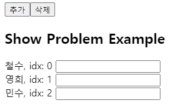
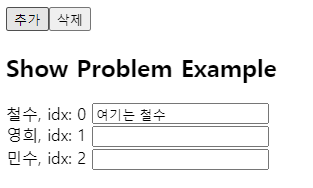
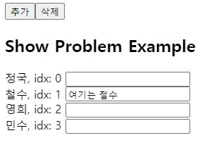
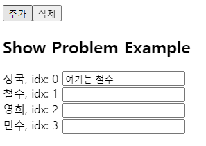
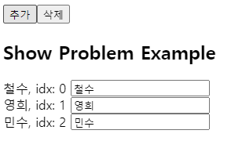
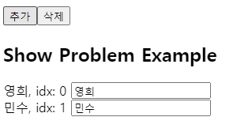
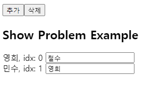

- 리액트는 key가 동일 할 경우, 동일한 DOM Element를 보여줌
- 때문에 key를 index로 뒀을 때 문제가 생길 수 있다.

## 예시

```ts
import React, { useEffect, useState } from 'react';

const Example = () => {
  const [list, setList] = useState([{ name: '철수' }, { name: '영희' }, { name: '민수' }]);

  const addItem = () => {
    setList([{ name: '정국' }, ...list]);
  };

  const delItem = () => {
    setList(list.filter((l) => l.name != '철수'));
  };

  return (
    <>
      {/* 추가 버튼과 삭제 버튼*/}
      <input type="button" value="추가" onClick={addItem} />
      <input type="button" value="삭제" onClick={delItem} />

      <h2> Show Problem Example</h2>
      {list.map((v, index) => (
        /*  div 태그의 key로 배열의 index 사용*/
        <div key={index}>
          {v.name}, idx: {index} <input type="text" />
        </div>
      ))}
    </>
  );
};

export default Example;
```

- line 22, 23: 추가, 삭제 버튼. 추가 버튼을 누르면 정국 데이터를 list 앞에 추가하고 삭제를 누르면 철수를 삭제한다.
- line 28: component가 관리하는 list 데이터를 map으로 loop 돌며 div 태그의 key를 index로 지정한다.

### 추가할 때


철수 input에 데이터를 입력


추가 버튼을 눌렀을 때


이러한 결과를 예상했지만


이러한 결과가 나온다.

- list 값이 변경되면서 index를 다시 mapping함
- 맨 앞에 추가된 정국은 key = 0
- key가 동일 할 경우, 동일한 DOM Element 보여줌

### 삭제할 때


위 상황에서 삭제를 눌렀을 때


이러한 결과를 예상하지만


이러한 결과가 나온다.

- 삭제가 되면서 다시 mapping
- 영희가 철수의 index였던 0이 됨
- 철수 데이터가 영희에게 mapping

## 해결

- 이를 해결하기 위해서 key 값에 index가 아닌 unique한 값을 주면 된다.
  - 위의 예시에서는 name을 key 값으로 주면 해결
