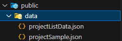
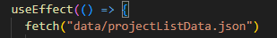

회사에서 동기와 작업 중 인데 (나 프론트 동기 백엔드)
동기가 이슈로 인해 작업 진도가 좀 차질이 생겼다.

언제까지 api를 기다릴 수 없기 때문에 임시 데이터를 만들어서 작업하자고 생각했다.

## Faker.js vs Mock data

- 전에 Faker.js 를 사용했었는데 임시 값 들이 임시라고 해도 너무 안맞는 것 같았다.
  - ui를 그려낼 수는 있지만 오히려 헷갈렸다.
- 그래서 mock data를 만들어서 사용하기로 생각했다.

## 적용

위 사진과 같이 public - data 폴더 안에 json 파일을 만들어주면 된다.

그리고 위와 같이 경로에다가 요청을 하면 된다.

## 주의할 점

- GET 만 가능하다.
  - 당연한거긴 하다.. (next 쓰고 싶다..)
