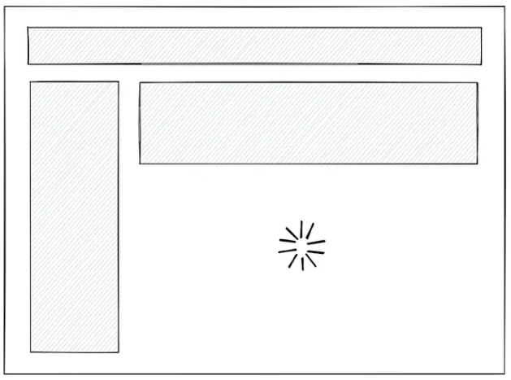
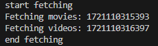

- await를 해야하는 부분을 명시적으로 나타내는 것

## 이것이 의미하는 것

- React 18에 추가됨
- SPA의 단점인 초기 랜더링에 시간이 오래걸리는 문제를 해결 할 수 있음.

```js
<Layout>
  <NavBar />
  <Sidebar />
  <RightPanel>
    <Post />
    <Suspense fallback={<Spinner />}>
      <Comments />
    </Suspense>
  </RightPanel>
</Layout>
```



- Comments에서 fetch 같은 비동기 작업 때문에 랜더링 되는데 시간이 걸림
- Suspense는 Comments가 await 해야함을 알리고
- 다른 컴포넌트들을 먼저 랜더링함.

## next에서 활용

```ts
// 영화 상세정보
async function getMovie(id: string) {
  console.log(`Fetching movies: ${Date.now()}`);
  await new Promise((resolve) => setTimeout(resolve, 1000));
  const response = await fetch(`${API_URL}/${id}`);
  return response.json();
}
```

```ts
// 영화 영상정보
async function getVideos(id: string) {
  console.log(`Fetching videos: ${Date.now()}`);
  await new Promise((resolve) => setTimeout(resolve, 1000));
  const response = await fetch(`${API_URL}/${id}/videos`);
  return response.json();
}
```

```ts
export default async function MovieDetail({ params: { id } }: { params: { id: string } }) {
  console.log('start fetching');
  const movie = await getMovie(id);
  const videos = await getVideos(id);
  console.log('end fetching');
  return <h1>{movie.title}</h1>;
}
```

- Movie Detail 페이지가 랜더링되면
- movie와 videos는 동기적으로 실행된다
  
- 두 함수가 실행된 시간이 다르다는 것을 알 수 있음

- 위 함수들은 동기적으로 실행될 필요가 없다.
  - 비동기적으로 실행하려면 어떻게 할까?

## Promise.all()

```ts
const [movie, videos] = await Promise.all([getMovie(id), getVideos(id)]);
```

- 위와 같이 코드를 변경하면 되는데
- 배열 안에 있는 함수들을 비동기적으로 실행시키고 그 결과값을 배열로 전해준다.
- 여기에 문제가 있는데
- 위 코드는 배열 안 함수가 모두 종료되어야 결과값이 나온다.
- 동시에 시작 > 모든 함수 종료될 때 까지 기다림

## Suspense

```ts
<div>
  <Suspense fallback={<h1>Loading Movie Info</h1>}>
    <MovieVideos id={id} />
  </Suspense>
  <Suspense fallback={<h1>Loading Movie Video</h1>}>
    <MovieInfo id={id} />
  </Suspense>
</div>
```

- Suspense를 사용하여 해당 컴포넌트가 await 해야 함을 알리고
- 모든 컴포넌트가 비동기적으로 실행되고 끝나는대로 fallback과 교체된다.
